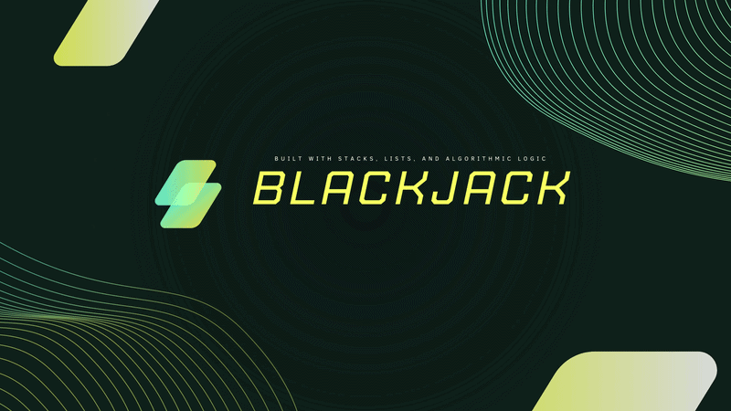

<!-- ================= HEADER ================= -->

<h1 align="center">
  
</h1>

  
  
  

---

# About Me

I design and build structured, real-world systems focused on scalability, maintainability, and performance

Core focus areas:

- Clean architecture
- Design patterns
- Secure authentication systems
- Database-driven applications
- Persistent state management
- Performance-oriented engineering

---

# SKILLS & TECHNOLOGIES

## Languages

  

---

## Mobile Development

  

  
  
  
  
  

---

## Frameworks & Tools

  

---

## Databases & Methodologies

  

  
  

---

# FEATURED SYSTEM — CASINO 21 ENGINE

  

A structured betting engine inspired by modern crypto casino platforms

### Core Engineering Highlights

- Chip-based betting logic (1 / 5 / 10 / 25 / 100)
- Authentication + persistent balance system
- Event-driven score calculation
- State-controlled UI flow
- JSON-based data persistence

**Stack:**  
C# | Windows Forms | OOP | Event-Driven Architecture | JSON Persistence

---

# TRADING SYSTEM

## CryptoTrade Trading Simulation Platform

Simulated trading engine focused on order handling, portfolio tracking, and transactional logic

### Highlights

- Order execution simulation
- Portfolio balance tracking
- Trading state management
- Structured backend logic

---

# CLINIC MANAGEMENT SYSTEM

Role-based system handling patients, doctors, and workflows

### Highlights

- Secure authentication system
- Layered architecture design
- Database interaction (CRUD)
- Separation of concerns

---

# TASK MANAGEMENT SYSTEM

Full-stack role-controlled task assignment platform

### Highlights

- Role-based access control
- Backend API logic
- Database integration
- Authentication management
